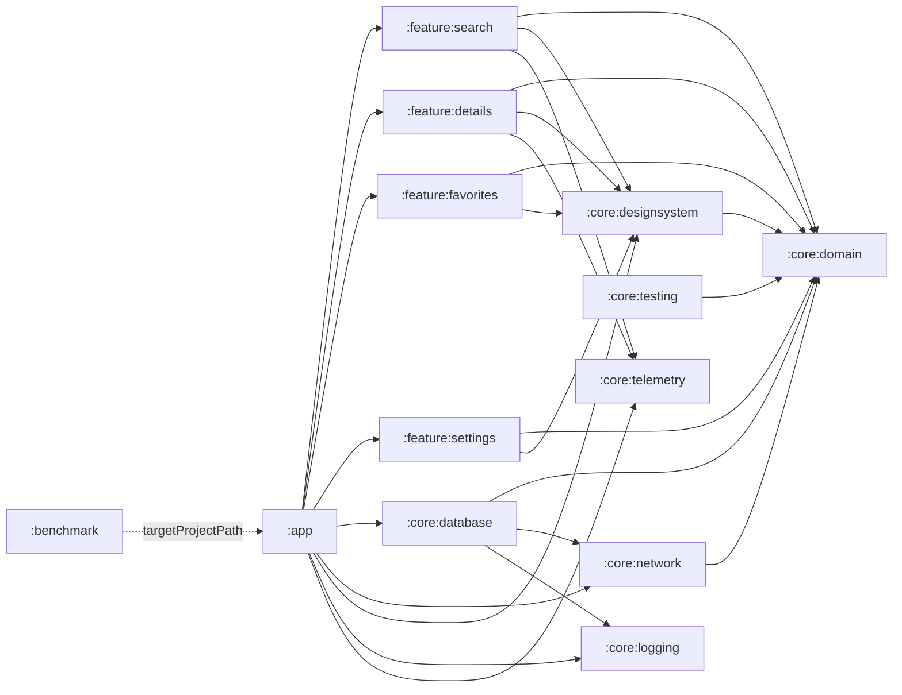
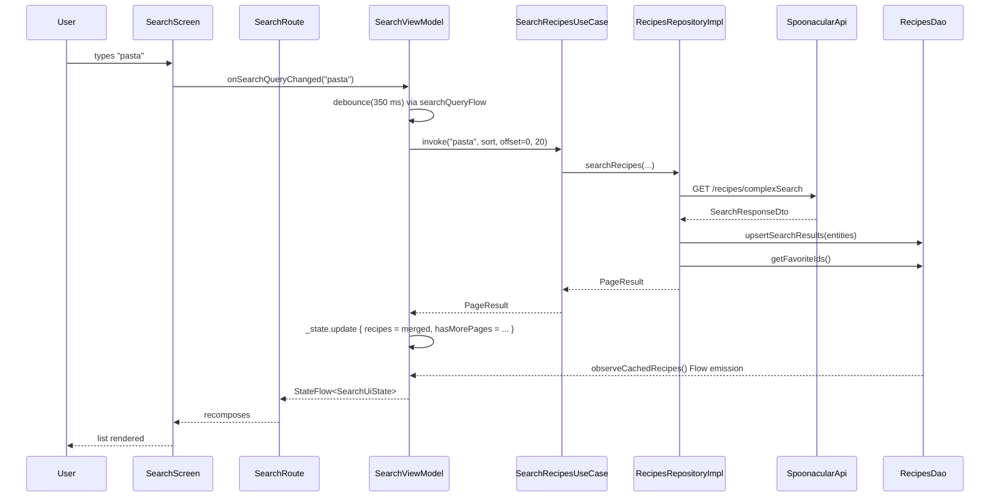

# Architecture

## Overview

ING Recipes is a multi-module, offline-first, Jetpack Compose application organised around clean architecture. The domain layer is pure Kotlin and owns the abstract model; data modules implement that model against Retrofit and Room; feature modules render it via Compose and Hilt-injected ViewModels. The `:app` module is a thin host whose only responsibility is wiring Hilt, providing the theme, and driving navigation. Cross-cutting concerns (design system, logging, telemetry, testing) live in dedicated `core:*` modules so every feature depends on abstractions, not on each other.

## Module Graph



`:core:domain` is the single source of truth for cross-cutting types — notably `ThemeMode` (`core/domain/src/main/java/.../model/ThemeMode.kt`) and `SettingsRepository` (`core/domain/src/main/java/.../repository/SettingsRepository.kt`). `:core:designsystem` depends on `:core:domain` so it can host `UiText` and the central `Throwable.toUiText()` (see *Error mapping*).

| Module | Role |
| --- | --- |
| `:app` | Host `Application`, `MainActivity`, Hilt entry point, navigation graph, theme wiring, app-level Hilt graph test. |
| `:benchmark` | `com.android.test` module — macrobenchmarks (cold startup, scroll) and Baseline Profile generator targeting `:app`. |
| `:core:domain` | Pure Kotlin models (`Recipe`, `RecipeDetails`, `Ingredient`, `RecipeStep`, `SortOrder`, `PageResult`, `ErrorKind`, `ThemeMode`), use cases, repository interfaces (`RecipesRepository`, `SettingsRepository`), error classification (`Throwable.toErrorKind()`). |
| `:core:database` | Room entities, `RecipesDao`, `RecipeEntityMapper`, and `RecipesRepositoryImpl` (the offline-first repo that implements `:core:domain`'s interface). |
| `:core:network` | Retrofit `SpoonacularApi`, DTOs, `DtoMapper`, interceptors (API key, common headers, cancellation-safe retry) and the OkHttp client assembled via `@IntoSet InterceptorEntry` with ordered application/network phases. |
| `:core:designsystem` | Material 3 theme (`RecipesTheme`), tonal palette, `Spacing`/`Sizing`/`Shape`/`Type` tokens, shared Composables (`RecipeCard`, `SearchBar`, `SortChipsRow`, `LoadingState`, `ErrorState`, `EmptyState`, `ConnectivityBanner`, `FavoriteButton`), the `UiText` localisation primitive, and the central `Throwable.toUiText()` extension (`util/ErrorUiMapper.kt`). Depends on `:core:domain` to consume `ErrorKind`. |
| `:core:logging` | `Logger` interface with flavour-scoped implementations: `TimberLogger` in `src/debug`, `NoOpLogger` in `src/release`. |
| `:core:telemetry` | `EventTracker` interface with `NoOpEventTracker` as the default binding. |
| `:core:testing` | `FakeRecipesRepository` and `TestFixtures` used by feature unit tests so they can avoid touching Room or Retrofit. |
| `:feature:search` | Search tab — `SearchViewModel`, `SearchRoute`, `SearchScreen`, infinite scroll, debounce, Material 3 `PullToRefreshBox`, offline-aware snackbar fallback, optimistic favorite toggle. |
| `:feature:details` | Recipe detail with `@AssistedInject` ViewModel keyed by `recipeId`. |
| `:feature:favorites` | Favorites tab backed by the same repository `Flow`, with optimistic favorite toggle. |
| `:feature:settings` | Theme + dynamic-color preferences. `SettingsRepositoryImpl` (DataStore) implements the `SettingsRepository` interface that lives in `:core:domain/repository/`. |

Convention plugins in `build-logic/convention/` (`recipes.android.library`, `recipes.android.feature`) keep AGP config, Compose, Hilt, KSP, flavour dimensions, and JVM target consistent across every module.

## Layering

```
Presentation  (Compose UI, ViewModel, UiState, SideEffect)
      │
      ▼
   Domain     (Use cases, repository interface, models, error mapping)
      │
      ▼
    Data      (Retrofit API, Room DAO, mappers, repository impl)
      │
      ▼
   Model      (Data classes, DTOs, entities)
```

- **Model**: `core/domain/src/main/java/.../model/Recipe.kt`, `RecipeDetails.kt`, `SortOrder.kt`, `PageResult.kt`, `ErrorKind.kt`, `ServerException.kt`. Plain, framework-free.
- **Domain**: use cases in `core/domain/src/main/java/.../usecase/` — `SearchRecipesUseCase`, `ObserveCachedRecipesUseCase`, `ObserveFavoritesUseCase`, `GetRecipeDetailsUseCase`, `ObserveRecipeDetailsUseCase`, `ToggleFavoriteUseCase`. Use cases expose `Flow` for reactive data and `suspend` for one-shots. Repository interface at `core/domain/src/main/java/.../repository/RecipesRepository.kt`.
- **Data**: `core/database/src/main/java/.../repository/RecipesRepositoryImpl.kt` is the single implementation of `RecipesRepository`; it owns the offline-first contract. Retrofit lives behind it; Room is the source of truth the UI observes.
- **Presentation**: `feature/*/src/main/java/.../viewmodel/*ViewModel.kt` and `feature/*/src/main/java/.../presentation/*Route.kt` + `*Screen.kt`.

**Invariant**: UI never touches `core:database` or `core:network` directly. It depends on `core:domain` only. This is enforced at the Gradle level — feature modules declare `implementation(project(":core:domain"))` but *not* `:core:database` or `:core:network`. The `:app` module is the only place those data modules are wired in to provide the concrete repository implementation.

## Packages & Conventions

Root package: `nl.ing.assessment.recipes`.

```
nl.ing.assessment.recipes
├── core
│   ├── domain         (model, usecase, repository, mapper)
│   ├── database       (entity, dao, mapper, repository, di)
│   ├── network        (dto, api, interceptor, mapper, di)
│   ├── designsystem   (theme, component, util)
│   ├── logging        (Logger, TimberLogger, NoOpLogger, di)
│   ├── telemetry      (EventTracker, NoOpEventTracker, di)
│   └── testing        (fakes, fixtures)
├── feature
│   ├── search         (viewmodel, presentation)
│   ├── details        (viewmodel, presentation.components)
│   ├── favorites      (viewmodel, presentation)
│   └── settings       (data, viewmodel, presentation, di)
├── app                (MainActivity, IngRecipesApplication, navigation, di)
└── benchmark          (RecipesBenchmark, BaselineProfileGenerator)
```

Gradle conventions:

- `build-logic/convention/src/main/kotlin/RecipesAndroidLibraryPlugin.kt` — every `core:*` and `feature:*` module applies this; it sets `compileSdk=36`, `minSdk=24`, JVM 11, `dev`/`prod` flavours, unit-test coverage, and only enables `androidTest` when the module has android test sources.
- `build-logic/convention/src/main/kotlin/RecipesAndroidFeaturePlugin.kt` — extends the library plugin with Compose, Kotlin Serialization, Hilt, and KSP. Applied by every `feature:*` module (and, because `:app` also includes Compose and Hilt, by `:app`).
- Shared versions live in `gradle/libs.versions.toml`. Never hard-code a version in a module's `build.gradle.kts`.

## Key Patterns

### ViewModel

```kotlin
@HiltViewModel
class SearchViewModel @Inject constructor(
    private val searchRecipes: SearchRecipesUseCase,
    private val observeCachedRecipes: ObserveCachedRecipesUseCase,
    private val toggleFavoriteUseCase: ToggleFavoriteUseCase,
    private val eventTracker: EventTracker,
) : ViewModel() {
    private val _state = MutableStateFlow(SearchUiState())
    val state: StateFlow<SearchUiState> = _state.asStateFlow()

    private val _sideEffects = Channel<SearchSideEffect>(Channel.BUFFERED)
    val sideEffects = _sideEffects.receiveAsFlow()

    fun onSearchQueryChanged(query: String) { /* ... */ }
    fun refresh() { /* ... */ }
    fun loadNextPage() { /* ... */ }
    fun toggleFavorite(recipe: Recipe) { /* ... */ }
}
```

- `StateFlow<UiState>` for everything the UI renders.
- `Channel<SideEffect>` for one-shot actions (`NavigateToDetails`, `ShowSnackbar`, `OpenUrl`) — these must not be part of the rendered state because they are consumed exactly once.
- Named public methods, not an `onEvent(event: Event)` dispatcher. See `feature/search/src/main/java/.../viewmodel/SearchViewModel.kt`.

### Route / Screen split

- `Route` composable is the only thing the navigation graph knows about. It owns the Hilt `viewModel()`, the `collectAsStateWithLifecycle`, and the `LaunchedEffect { viewModel.sideEffects.collect { ... } }` that converts side effects into navigation calls and snackbars.
- `Screen` composable is stateless: it takes `state` plus callbacks, has no Hilt dependency, and can be rendered in a preview or Compose test without any ViewModel.

```kotlin
// feature/search/src/main/java/.../presentation/SearchRoute.kt
@Composable
fun SearchRoute(onNavigateToDetails: (Int) -> Unit, onShowSnackbar: (String) -> Unit,
                viewModel: SearchViewModel = hiltViewModel()) {
    val state by viewModel.state.collectAsStateWithLifecycle()
    LaunchedEffect(Unit) {
        viewModel.sideEffects.collect { effect ->
            when (effect) {
                is SearchSideEffect.NavigateToDetails -> onNavigateToDetails(effect.recipeId)
                is SearchSideEffect.ShowSnackbar -> onShowSnackbar(effect.message.asString(context))
            }
        }
    }
    SearchScreen(state = state, onSearchQueryChanged = viewModel::onSearchQueryChanged, ...)
}
```

### Assisted injection for parameterised ViewModels

`DetailsViewModel` depends on `recipeId`, which is runtime data, so it uses `@AssistedInject` with `@HiltViewModel(assistedFactory = DetailsViewModel.Factory::class)`. See `feature/details/src/main/java/.../viewmodel/DetailsViewModel.kt`.

### `UiText`

Localisation is expressed through a sealed interface so ViewModels can return strings without depending on `Context`:

```kotlin
// core/designsystem/src/main/java/.../util/UiText.kt
sealed interface UiText {
    data class Raw(val value: String) : UiText
    data class Resource(@StringRes val resId: Int, val args: List<Any> = emptyList()) : UiText
}
```

Resolution happens inside a `@Composable` (`asString()`) or with an explicit `Context` (`asString(context)` from the `Route`'s side-effect collector).

### Immutable UI state

Every `*UiState` is annotated `@Immutable` and collections are `kotlinx.collections.immutable.ImmutableList`. This lets Compose skip recompositions reliably when the reference is unchanged.

### Repository offline-first contract

```kotlin
// core/database/src/main/java/.../repository/RecipesRepositoryImpl.kt
override suspend fun searchRecipes(query, sort, offset, number): PageResult {
    val response = wrapHttpException { api.searchRecipes(query, sort.toApiParam(), null, offset, number) }
    val entities = response.results.map { RecipeMapperHelper.summaryToEntity(it, now, json) }
    dao.upsertSearchResults(entities)                  // <-- cache first
    val favorites = dao.getFavoriteIds().toSet()       // <-- preserve isFavorite
    val items = entities.map { e -> (if (e.id in favorites) e.copy(isFavorite = true) else e).toDomain() }
    return PageResult(items, response.totalResults, response.offset, hasMore = ...)
}
```

Every successful network result is written to Room *before* it is returned. The favorite flag is always reapplied from the DAO so a remote `false` cannot silently unfavorite a recipe the user starred locally.

### Error mapping

The error pipeline is a strict two-hop translation:

```
Throwable --(:core:domain)--> ErrorKind --(:core:designsystem)--> UiText
```

1. `Throwable.toErrorKind()` in `core/domain/src/main/java/.../mapper/ErrorKindMapper.kt` classifies any thrown error as `Network`, `Server`, `RateLimited`, or `Unknown`. This step is pure Kotlin and lives in `:core:domain` because it owns the taxonomy.
2. `Throwable.toUiText()` in `core/designsystem/src/main/java/.../util/ErrorUiMapper.kt` is the single source of truth that ViewModels call. It delegates to `toErrorKind()` and resolves to a `UiText.Resource` pointing at `R.string.error_network` / `error_server` / `error_rate_limited` / `error_unknown` from `:core:designsystem`. It lives here (and not in `:core:domain`) because `:core:designsystem` already depends on `:core:domain` and owns the string resources — putting the mapper here avoids a circular dependency and removes per-ViewModel error-string duplication.

No ViewModel builds error strings by hand. `SearchViewModel`, `FavoritesViewModel`, `DetailsViewModel`, and `SettingsViewModel` all call `throwable.toUiText()` and push the result into either `UiState.error` or a `ShowSnackbar` side effect.

## Navigation

The navigation graph lives in `app/src/main/java/.../navigation/AppNavigation.kt` and is built on Navigation 3. `AppNavigation` hosts a single `Scaffold` that owns the cross-cutting UI chrome — a `ConnectivityBanner` top bar, an app-wide `SnackbarHost`, and a root-only `NavigationBar` bottom bar — and `NavDisplay` runs inside its content slot:

```kotlin
val backStack = rememberNavBackStack(AppRoute.Search)
val snackbarHostState = remember { SnackbarHostState() }
val isOnRoot = backStack.size <= 1

Scaffold(
    topBar = { ConnectivityBanner() },
    bottomBar = { if (isOnRoot) NavigationBar { /* Search / Favorites / Settings tabs */ } },
    snackbarHost = { SnackbarHost(hostState = snackbarHostState) },
) { innerPadding ->
    NavDisplay(
        backStack = backStack,
        onBack = { if (backStack.size > 1) backStack.removeLastOrNull() },
        modifier = Modifier.fillMaxSize().padding(innerPadding),
        entryProvider = entryProvider {
            entry<AppRoute.Search>    { SearchRoute(onNavigateToDetails = { id -> backStack.add(AppRoute.Details(id)) }, onShowSnackbar = showSnackbar) }
            entry<AppRoute.Favorites> { FavoritesRoute(...) }
            entry<AppRoute.Settings>  { SettingsRoute(onBack = { backStack.removeLastOrNull() }) }
            entry<AppRoute.Details>   { route -> DetailsRoute(recipeId = route.recipeId, onBack = { ... }, onShowSnackbar = showSnackbar) }
        },
    )
}
```

The `onShowSnackbar` callback is a `(String) -> Unit` that every `Route` receives from `AppNavigation`, so snackbar messages emitted by any feature's `SideEffect` channel surface on the shared host rather than a per-screen one.

Routes are typed, serializable `NavKey`s:

```kotlin
// app/src/main/java/.../navigation/AppRoute.kt
@Serializable
sealed interface AppRoute : NavKey {
    @Serializable data object Search : AppRoute
    @Serializable data class Details(val recipeId: Int) : AppRoute
    @Serializable data object Favorites : AppRoute
    @Serializable data object Settings : AppRoute
}
```

**Deep links**. `DeepLinkParser` accepts `recipes://recipe/<id>` and returns the id or `null`:

```kotlin
// app/src/main/java/.../navigation/DeepLinkParser.kt
fun parseRecipeDeepLink(uri: Uri?): Int? {
    if (uri == null || uri.scheme != "recipes" || uri.host != "recipe") return null
    return uri.pathSegments.firstOrNull()?.toIntOrNull()
}
```

`MainActivity` passes the parsed id to `AppNavigation(initialDeepLinkRecipeId = ...)`, which pushes it onto the back stack in a `LaunchedEffect`, preserving the `Search` root underneath so Back returns to the list.

**Bottom bar** is rendered by the `Scaffold` only when `backStack.size <= 1`. Selecting a root tab clears the stack and adds the new root key; non-root destinations (like `Details`) simply hide the bar and Back pops the stack.

## Theming

- ING tonal palette in `core/designsystem/src/main/java/.../theme/Color.kt` (Primary40 `#FF6200`, Secondary40 `#0054A6` navy, Tertiary40 `#7A5900` warm gold, plus full neutral + error ramps).
- `RecipesTheme` assembles both `lightColorScheme` and `darkColorScheme` from those tokens. Live at `core/designsystem/src/main/java/.../theme/Theme.kt`.
- `ThemeMode` (`SYSTEM` / `LIGHT` / `DARK`) lives in `core/domain/src/main/java/.../model/ThemeMode.kt`. It is persisted through the `SettingsRepository` interface in `:core:domain/repository/`, whose single implementation is `SettingsRepositoryImpl` in `feature/settings/src/main/java/.../data/SettingsRepositoryImpl.kt` (Preferences DataStore, keys `theme_mode` + `dynamic_color`). There is no separate `SettingsManager`; all reads and writes go through the repository interface.
- Dynamic color is opt-in and only applied on Android 12+ (`Build.VERSION.SDK_INT >= Build.VERSION_CODES.S`). When enabled, `dynamicLightColorScheme(context)` / `dynamicDarkColorScheme(context)` replaces the ING palette; otherwise the ING tonal palette is used.
- `Spacing`, `Sizing`, `Shape`, `Type` tokens are exposed as `CompositionLocal`s (`MaterialTheme.spacing`, `MaterialTheme.sizing`) so feature code never hard-codes a dp value.

## Data Flow



The cached-recipes `Flow` (`observeCachedRecipes`) runs independently of the search call, so changes from `toggleFavorite` or from `fetchRecipeDetails` propagate into the search list without re-issuing a network request.

## Testing Strategy

| Layer | Tooling | Examples |
| --- | --- | --- |
| Domain + mappers | JUnit, pure | `core/domain/src/test/.../SearchRecipesUseCaseTest.kt`, `ObserveFavoritesUseCaseTest.kt`, `ToggleFavoriteUseCaseTest.kt`, `ErrorKindMapperTest.kt`, `SortOrderTest.kt` |
| Repo | Robolectric + MockK + Turbine | `core/database/src/test/.../RecipesRepositoryImplTest.kt`, `RecipeEntityMapperTest.kt` |
| Network DTO + interceptors | MockWebServer + JUnit | `core/network/src/test/.../RecipeDtoMapperTest.kt`, `ApiKeyInterceptorTest.kt`, `RetryInterceptorTest.kt` (includes a cancellation/interrupt propagation test), `CommonHeadersInterceptorTest.kt` |
| ViewModel | `FakeRecipesRepository` from `:core:testing`, coroutines-test, Turbine | `feature/search/src/test/.../SearchViewModelTest.kt`, `feature/details/src/test/.../DetailsViewModelTest.kt`, `FavoritesViewModelTest.kt`, `SettingsViewModelTest.kt` |
| Compose UI (per feature) | `ComposeTestRule` against stateless `Screen` composables | `feature/search/src/androidTest/.../SearchScreenTest.kt` (5), `feature/favorites/src/androidTest/.../FavoritesScreenTest.kt` (4), `feature/details/src/androidTest/.../DetailsScreenTest.kt` (4), `feature/settings/src/androidTest/.../SettingsScreenTest.kt` (4) |
| Room DAO | Android instrumentation | `core/database/src/androidTest/.../RecipesDaoTest.kt` |
| Hilt graph + navigation flow | Instrumented `@HiltAndroidTest` via `HiltTestRunner` | `app/src/androidTest/.../HiltGraphTest.kt`, `AppNavigationFlowTest.kt` (Search → bottom-bar → Favorites, against real `MainActivity` + Hilt graph), `FakeTestRepositoryModule.kt`, `HiltTestRunner.kt` |
| Macrobenchmark | `MacrobenchmarkRule` | `benchmark/src/main/.../RecipesBenchmark.kt` (cold startup, scroll `search_list`; the scroll benchmark seeds a `"pasta"` query into `search_bar` in its `setupBlock` so the list always has data) |
| Baseline profile | `BaselineProfileRule` | `benchmark/src/main/.../BaselineProfileGenerator.kt` — walks the full user journey (Search → list scroll → Details → back → Favorites → Settings → theme toggle → Search). Consumed by `:app` automatically via the `androidx.baselineprofile` plugin + `androidx.profileinstaller`. |

`HiltTestRunner` is wired as `testInstrumentationRunner` in `:app/build.gradle.kts`, `:benchmark/build.gradle.kts`, and `RecipesAndroidLibraryPlugin`, so every module with `src/androidTest` sources can run `@HiltAndroidTest` against `HiltTestApplication`.

`:core:testing` is explicitly excluded from the aggregated coverage report (along with `:benchmark`) so test-support code does not dilute the numbers.

## Build

- **Convention plugins**: `recipes.android.library` and `recipes.android.feature` (in `build-logic/convention`). Every library module applies the former; every feature module applies the latter. The library plugin sets `testInstrumentationRunner = "nl.ing.assessment.recipes.HiltTestRunner"` by default so `@HiltAndroidTest` works in any library that grows `src/androidTest`.
- **Flavour dimension** `environment`: `dev`, `prod`. Both resolve to the same `BASE_URL` today but exist so alternative environments can be wired without touching Kotlin. See `core/network/build.gradle.kts`.
- **Build types**: `debug`, `release` (`isMinifyEnabled = true`, `isShrinkResources = true`, `proguard-android-optimize.txt` + `app/proguard-rules.pro`), and a `benchmark` type declared in both `:app` and `:benchmark`. The `:app` benchmark type inherits from `release`, keeps R8 enabled, but is debuggable so macrobenchmarks can attach. `:benchmark` sets `matchingFallbacks += "release"`.
- **Baseline profile plumbing**: `:app` applies the `androidx.baselineprofile` plugin and declares `"baselineProfile"(project(":benchmark"))` + `implementation(libs.androidx.profileinstaller)`. `:benchmark` also applies the plugin and hosts `BaselineProfileGenerator`. At release-build time, the plugin invokes the generator (when producing the profile) and packages the resulting `baseline-prof.txt` into `:app`'s APK, which `androidx.profileinstaller` then installs on device.
- **`BuildConfig`** fields injected from `local.properties` / env: `SPOONACULAR_API_KEY`, `BASE_URL`, `VERSION_NAME`, `DEBUG_INTERCEPTORS`.
- **Source sets per build type**: `core:network/src/debug/...` adds an `HttpLoggingInterceptor` via `DebugInterceptorModule` (Hilt `@IntoSet`); `src/release/...` adds a no-op `ReleaseInterceptorModule`. `core:logging` has the same split for `TimberLogger` vs `NoOpLogger`.
- **KSP** drives Hilt (`hilt-android-compiler`) and Room (`androidx.room`) code generation.
- **Detekt** is wired in the root `build.gradle.kts` via `subprojects { apply(plugin = "io.gitlab.arturbosch.detekt") }` with `config/detekt/detekt.yml`.
- **JaCoCo aggregated report**: the root `jacocoCombinedReport` task (`build.gradle.kts`) depends on every module's `testDevDebugUnitTest`, collects `.exec` files from `outputs/unit_test_code_coverage/devDebugUnitTest`, and emits HTML + XML at `build/reports/jacoco/combined/`. Generated Hilt classes, activities, Compose previews, serializers, and Room `_Impl` classes are filtered out via `fileFilter`.
- **`allInstrumentedTests`** root task discovers every module that actually has `src/androidTest` sources and runs their `connectedDevDebugAndroidTest` tasks.

## Known Limitations

- The `recipes://recipe/<id>` deep link is parsed and unit-tested, but no `<intent-filter>` is registered in `AndroidManifest.xml`, so the OS cannot currently route a URL to the app. Adding this is a one-line manifest change, but it has not been wired.
- Paging is offset-based and manual. There is no `RemoteMediator`, no transparent retry on cursor loss, and no cross-session restoration of the paging state. Paging 3 would replace this if the feature set grew.
- Image loading (Coil) has no explicit pre-cache strategy; list rows trigger a fetch on composition. Scroll jank is not profiled beyond the general macrobenchmark.
- Crash reporting is a `NoOpLogger` / `NoOpEventTracker` in release. A production build would need real implementations wired behind a consent flag.
- `SPOONACULAR_API_KEY` is injected into `BuildConfig`, which puts the string literal in the APK. This is acceptable for a challenge but is not a secrets boundary.
- There is no CI pipeline configured in the repo; the quality gates (unit, Detekt, JaCoCo, instrumentation, macrobenchmark, baseline profile) all exist as Gradle tasks but must be invoked manually.
