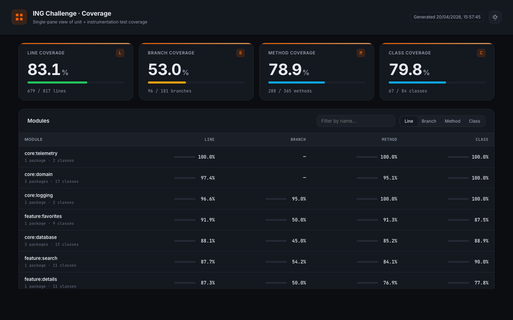
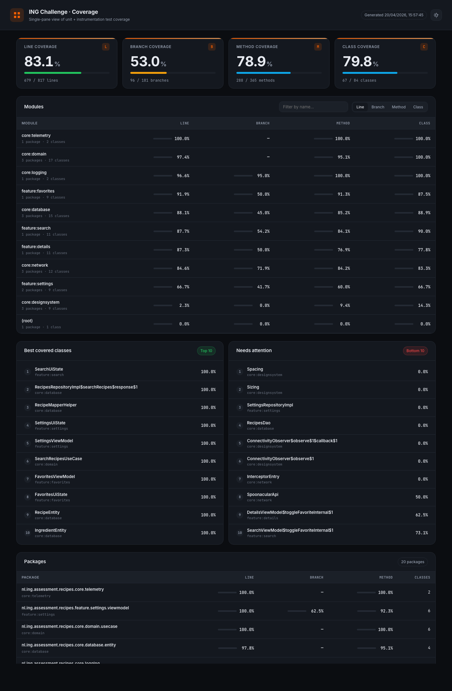
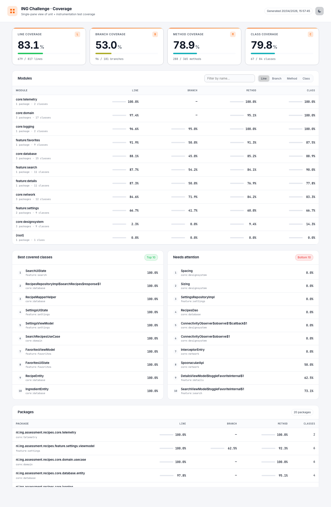

# ING Challenge — Recipe Search


A multi-module Jetpack Compose Android app built against Spoonacular's `complexSearch` API for the ING coding challenge. Recipes are searchable, sortable, paginated, cacheable offline via Room, and themable through the ING design system. The codebase is organised around clean architecture, convention plugins, and a staff-engineer level test pyramid (unit, instrumentation, macrobenchmark, baseline profile).

## Staff-level techniques used (quick index)

If you're scanning this repo for the senior-engineering bits, here's where to look:

| # | Technique | Where |
|---|-----------|-------|
| 1 | Convention plugins (`recipes.android.application` / `library` / `feature`) + version catalog | [`build-logic/convention/`](build-logic/convention/), [`gradle/libs.versions.toml`](gradle/libs.versions.toml) |
| 2 | Hilt `@IntoSet` `InterceptorEntry` with `order` + `type`, plus `src/debug` vs `src/release` source-set DI swap | [`core/network/src/main/.../di/InterceptorBindingsModule.kt`](core/network/src/main/java/nl/ing/assessment/recipes/core/network/di/InterceptorBindingsModule.kt), [`core/network/src/debug/`](core/network/src/debug), [`core/logging/src/debug/`](core/logging/src/debug) |
| 3 | `@AssistedInject` + `@HiltViewModel(assistedFactory = ...)` for typed nav args | [`feature/details/.../DetailsViewModel.kt`](feature/details/src/main/java/nl/ing/assessment/recipes/feature/details/viewmodel/DetailsViewModel.kt) |
| 4 | Navigation 3 with `@Serializable sealed interface AppRoute : NavKey` + deep-link parser | [`app/.../navigation/AppRoute.kt`](app/src/main/java/nl/ing/assessment/recipes/navigation/AppRoute.kt), [`AppNavigation.kt`](app/src/main/java/nl/ing/assessment/recipes/navigation/AppNavigation.kt), [`DeepLinkParser.kt`](app/src/main/java/nl/ing/assessment/recipes/navigation/DeepLinkParser.kt) |
| 5 | Route/Screen MVVM split — stateless `*Screen`, named lambdas, no `onEvent` dispatcher | [`feature/search/.../SearchRoute.kt` + `SearchScreen.kt`](feature/search/src/main/java/nl/ing/assessment/recipes/feature/search/presentation/) |
| 6 | Offline-first Room with `@Transaction upsertSearchResults` / `upsertRecipeDetails` that preserves `isFavorite`, plus a DAO test asserting it | [`core/database/.../dao/RecipesDao.kt`](core/database/src/main/java/nl/ing/assessment/recipes/core/database/dao/RecipesDao.kt), [`RecipesDaoTest.kt`](core/database/src/androidTest/java/nl/ing/assessment/recipes/core/database/dao/RecipesDaoTest.kt) |
| 7 | Compose perf contract: `@Immutable UiState` + `ImmutableList` + `LazyColumn(key, contentType)` + `snapshotFlow { layoutInfo }` infinite scroll | [`feature/search/.../SearchUiState.kt`](feature/search/src/main/java/nl/ing/assessment/recipes/feature/search/viewmodel/SearchUiState.kt), [`SearchScreen.kt`](feature/search/src/main/java/nl/ing/assessment/recipes/feature/search/presentation/SearchScreen.kt) |
| 8 | One-way data flow: `MutableStateFlow.asStateFlow()` + `Channel(BUFFERED).receiveAsFlow()`, never `SharedFlow` | every ViewModel under `feature/*/viewmodel/` |
| 9 | Design-system tokens via `Spacing`/`Sizing` data classes + `LocalSpacing`/`LocalSizing` composition locals + `MaterialTheme.spacing` / `.sizing` extensions | [`core/designsystem/.../theme/`](core/designsystem/src/main/java/nl/ing/assessment/recipes/core/designsystem/theme/) |
| 10 | `UiText` sealed interface + `Throwable.toUiText()` + `ErrorKind` hierarchy — error localisation without leaking `Context` | [`util/UiText.kt`](core/designsystem/src/main/java/nl/ing/assessment/recipes/core/designsystem/util/UiText.kt), [`util/ErrorUiMapper.kt`](core/designsystem/src/main/java/nl/ing/assessment/recipes/core/designsystem/util/ErrorUiMapper.kt), [`domain/mapper/ErrorKindMapper.kt`](core/domain/src/main/java/nl/ing/assessment/recipes/core/domain/mapper/ErrorKindMapper.kt) |

Honorable mentions: Hilt test-doubling via `@TestInstallIn(replaces = RepositoryModule::class)` with a shared [`FakeRecipesRepository`](core/testing/src/main/java/nl/ing/assessment/recipes/core/testing/FakeRecipesRepository.kt); cancellation-safe `RetryInterceptor` (polls `chain.call().isCanceled()` and restores the interrupt flag); debounced search pipeline (`searchQueryFlow.debounce(350L).distinctUntilChanged().onEach { performSearch(...) }.launchIn(...)`).

## Coverage dashboard

One command runs every module's unit tests, merges the JaCoCo XML, and renders a custom HTML dashboard (dark/light toggle, sortable modules, best/worst-covered class rankings, full package drill-down) — not the default JaCoCo HTML.

```bash
./gradlew coverageReport
open build/reports/coverage-dashboard/index.html
```

Pass `-PwithInstrumentation=true` to also run instrumented tests (requires a device).



<details>
<summary>Full page (dark and light)</summary>




</details>

The web project that renders the dashboard lives at [`coverage-dashboard/`](coverage-dashboard/) — it is a plain HTML/CSS/JS app with no toolchain; the Gradle task parses the merged JaCoCo XML into a JSON blob and inlines it into the generated `index.html` so double-clicking the file works.

## Local setup

1. Copy the sample file:

   ```bash
   cp local.properties.sample local.properties
   ```

2. Get a free Spoonacular API key at <https://spoonacular.com/food-api> and paste it into `local.properties`:

   ```properties
   SPOONACULAR_API_KEY=your_key_here
   ```

3. `local.properties` is git-ignored; never commit it.

> Note: a prior version of this repository accidentally included a live Spoonacular key. That key has been rotated — please request a fresh one as per step 2.

## Features

- Recipe search with 350 ms debounce against Spoonacular `complexSearch`.
- Sorting by relevance, popularity, healthiness, price, and time.
- Infinite scroll (manual offset-based paging) and Material 3 `PullToRefreshBox` on `SearchScreen`.
- Recipe detail screen with ingredients, instructions, and source link.
- Offline-first cache via Room: when the network drops, `SearchViewModel` keeps the existing cached list visible and surfaces the failure through a snackbar side effect instead of clearing the screen.
- Favorites marked offline-available, with optimistic UI toggle from both `SearchViewModel` and `FavoritesViewModel` (local state flips first, reverts on failure with a snackbar).
- Centralised error mapping: every `Throwable` is classified to an `ErrorKind` in `:core:domain` and resolved to a `UiText` via the single `Throwable.toUiText()` extension in `:core:designsystem/util/ErrorUiMapper.kt`. ViewModels never build error strings themselves.
- Material 3 theming driven by an ING tonal palette (Primary40 `#FF6200`).
- In-app theme toggle: System / Light / Dark, persisted in DataStore.
- Material You dynamic color on Android 12+ (behind a user preference).
- Deep link support: `recipes://recipe/<id>`.
- Full Compose UI on Navigation 3 (`rememberNavBackStack` + `NavDisplay`) inside a `Scaffold` whose top bar is a `ConnectivityBanner`, bottom bar is a `NavigationBar` that only renders on root destinations, and snackbar host is shared app-wide.
- Macrobenchmark module covering cold startup and list scroll, plus a Baseline Profile generator that is consumed by `:app` at release time (`androidx.profileinstaller` + the `androidx.baselineprofile` plugin wire `baselineProfile(project(":benchmark"))`).
- R8 minification + resource shrinking enabled on `release` (and inherited by the `benchmark` build type).

## Getting Started

### Prerequisites

- Android Studio Koala (or newer) with AGP 9.1+.
- JDK 17.
- Minimum Android SDK 24, compile/target SDK 36.
- A free Spoonacular API key from [spoonacular.com/food-api](https://spoonacular.com/food-api).

### Setup

1. Clone the repo.
2. Open `ing-challenge/local.properties` (create it if it does not exist) and add:

```bash
SPOONACULAR_API_KEY=<your_key>
```

   The key is read by `core/network/build.gradle.kts` and exposed through `BuildConfig.SPOONACULAR_API_KEY`. You can alternatively export `SPOONACULAR_API_KEY` as an environment variable.

3. Build and install the default dev-debug variant:

```bash
./gradlew :app:installDevDebug
```

Or open the project in Android Studio and run the `app` configuration.

> **Convention plugins**: the project uses three convention plugins defined in `build-logic/convention/`. The `:app` module applies `recipes.android.application` (adds `com.android.application`, Compose, Hilt, KSP, and the `jacocoCoverageCheck` task). Library modules apply `recipes.android.library`; feature modules apply `recipes.android.feature`.

### Variants

The app uses a two-axis variant matrix:

- **Flavor dimension `environment`**: `dev`, `prod`. Both currently point at `https://api.spoonacular.com/`, but the dimension exists so staging/mock URLs can be injected without code changes.
- **Build types**: `debug` (default), `release` (R8 enabled — `isMinifyEnabled = true` and `isShrinkResources = true`, with ProGuard rules in `app/proguard-rules.pro`), and `benchmark` (a release-like, debuggable variant declared in `:benchmark` with `matchingFallbacks += "release"` — used only when building against the benchmark module).

Combined variants you will typically run: `devDebug`, `prodDebug`, `devRelease`, `prodRelease`, plus `devBenchmark` / `prodBenchmark` for macrobenchmarks.

## Project Structure

```text
ing-challenge/
├── app/                      Host application, navigation graph, Hilt entry point.
├── benchmark/                Macrobenchmark + Baseline Profile generator (`com.android.test`).
├── build-logic/              Included build containing convention plugins.
│   └── convention/           `recipes.android.library` and `recipes.android.feature`.
├── core/
│   ├── domain/               Pure Kotlin: models (incl. `ThemeMode`), use cases, repository interfaces (`RecipesRepository`, `SettingsRepository`), `ErrorKind` + `Throwable.toErrorKind()`.
│   ├── database/             Room entities, DAO, `RecipesRepositoryImpl`, offline-first logic.
│   ├── network/              Retrofit `SpoonacularApi`, DTOs, interceptors (API key, retry, logging). The retry interceptor is cancellation-safe (polls `chain.call().isCanceled()` and restores the interrupt flag).
│   ├── designsystem/         Material 3 theme, `UiText`, central `Throwable.toUiText()` (`util/ErrorUiMapper.kt`), reusable Composables (cards, chips, states, `ConnectivityBanner`).
│   ├── logging/              `Logger` interface with `TimberLogger` (debug) / `NoOpLogger` (release).
│   ├── telemetry/            `EventTracker` interface; `NoOpEventTracker` wired by default.
│   └── testing/              `FakeRecipesRepository`, fixtures for ViewModel and feature tests.
├── feature/
│   ├── search/               Search tab: ViewModel, Route/Screen, side effects, pull-to-refresh, offline-aware snackbar fallback.
│   ├── details/              Recipe detail with `@AssistedInject` ViewModel.
│   ├── favorites/            Favorites tab backed by the same repo Flow, with optimistic favorite toggle.
│   └── settings/             Theme / dynamic-color preferences. `SettingsRepositoryImpl` (DataStore) binds to `:core:domain`'s `SettingsRepository`.
├── config/detekt/            Detekt ruleset.
└── gradle/libs.versions.toml Shared version catalog.
```

See [`ARCHITECTURE.md`](ARCHITECTURE.md) for module dependency graph and layering.

## Testing

```bash
./gradlew test                                                    # all JVM unit tests
./gradlew jacocoCombinedReport                                    # aggregated coverage (HTML + XML)
./gradlew :app:connectedDevDebugAndroidTest                       # instrumented tests on a device
./gradlew :core:database:connectedDevDebugAndroidTest             # Room DAO instrumentation
./gradlew :benchmark:connectedBenchmarkAndroidTest                # macrobenchmarks
./gradlew :benchmark:connectedBenchmarkAndroidTest -PenableBaselineProfile=true
```

- **Unit tests** live in every module under `src/test/...` and cover domain use cases, mappers (`RecipeDtoMapper`, `RecipeEntityMapper`), interceptors (including a dedicated cancellation test for `RetryInterceptor`), repos (Robolectric + MockK + Turbine), and all ViewModels.
- **Compose UI tests** (androidTest) cover every feature's stateless `Screen`: `SearchScreenTest` (5 tests), `FavoritesScreenTest` (4), `DetailsScreenTest` (4), and `SettingsScreenTest` (4), driven by `ComposeTestRule` and `FakeRecipesRepository` from `:core:testing`. A rewritten `AppNavigationFlowTest` at the `:app` level walks Search → bottom-bar → Favorites through the real `MainActivity` + Hilt graph.
- **Instrumented tests** also include a `HiltGraphTest` at the `:app` level that asserts the Hilt graph resolves at runtime, and a Room DAO test in `:core:database`. All `@HiltAndroidTest` classes run through the custom `HiltTestRunner`, which is wired as `testInstrumentationRunner` in `:app/build.gradle.kts`, `:benchmark/build.gradle.kts`, and the `recipes.android.library` convention plugin, so `HiltTestApplication` is installed everywhere.
- **Coverage report** is emitted to `build/reports/jacoco/combined/html/index.html`. Hilt-generated classes, Compose previews, and activities are filtered out.
- **Macrobenchmark** measures cold startup (`StartupTimingMetric`) and list scroll (`FrameTimingMetric`) against the `search_list` test tag on `SearchScreen`. The scroll benchmark seeds a `"pasta"` query into the `search_bar` in its `setupBlock` so the list always has data to scroll.
- **Baseline Profile** is produced by `BaselineProfileGenerator`, which walks the full user journey (Search → list scroll → Details → back → Favorites → Settings → theme toggle → Search). The resulting profile is consumed by `:app` automatically via the `androidx.baselineprofile` plugin and `androidx.profileinstaller`.

## Quality Gates

- **Detekt** — applied to every subproject via `subprojects { apply(plugin = "io.gitlab.arturbosch.detekt") }` in the root build; config at `config/detekt/detekt.yml`.
- **KSP** — used for Hilt and Room code generation.
- **JaCoCo** — per-module unit-test coverage merged by the root `jacocoCombinedReport` task. Run `./gradlew jacocoCombinedReport` to get the aggregated HTML + XML report.
- **`jacocoCoverageCheck`** — enforces a **minimum 50% line coverage** threshold (wired by the `recipes.android.application` convention plugin). Run with `./gradlew jacocoCoverageCheck`. Increase the threshold in `:app/build.gradle.kts` as coverage improves.
- **`coverageReport`** — single-command pipeline. Runs every module's unit tests, merges the JaCoCo results, and renders a **custom HTML dashboard** (modern dark/light UI, sortable per-module table, best/worst covered classes, full package drill-down) at `build/reports/coverage-dashboard/index.html`. The static web project itself lives at `coverage-dashboard/` — see its README for customisation. Pass `-PwithInstrumentation=true` to also run `allInstrumentedTests` (requires a device).
- **GitHub Actions CI** — on every push/PR to `main`: Gradle wrapper validation → `lintDevDebug` + Detekt → `testDevDebugUnitTest` + `jacocoCoverageCheck` → `assembleDevDebug` + `assembleProdRelease`. Instrumented tests and benchmarks are excluded from CI (device required). See `.github/workflows/ci.yml`.
- **Macrobenchmark + Baseline Profile** — runtime quality gate for startup and scroll performance.
- **Android Lint** — runs as part of `assemble` / `check`.

## Architectural Summary

- **Clean architecture in three layers**: `core:domain` (pure Kotlin) → `core:network` + `core:database` (data implementations) → `feature:*` (presentation). UI never touches data directly; it always goes through a use case.
- **Offline-first**: `RecipesRepositoryImpl` writes every successful network response into Room, then emits domain `Flow`s from the DAO. The ViewModel layer observes the cache and treats the network as a refresh trigger. When the network fails and a cached list is already on screen, `SearchViewModel` keeps the list visible and emits a snackbar side effect instead of swapping in an empty error state.
- **MVVM with Route/Screen split**: each feature exposes a `Route` (Hilt + side effects + navigation) and a stateless `Screen` (testable). `StateFlow<UiState>` for rendering, `Channel<SideEffect>` for one-shot actions. Favorite toggles are optimistic: the ViewModel flips the local row first and reverts on failure, accompanied by a `ShowSnackbar` side effect.
- **Material 3 + ING tokens** driven by `RecipesTheme`. `ThemeMode` (`SYSTEM`/`LIGHT`/`DARK`) lives in `:core:domain/model`; it is read and written through the `SettingsRepository` interface in `:core:domain/repository`, whose DataStore-backed implementation lives in `:feature:settings`. Dynamic color is opt-in on Android 12+.
- **Navigation 3**: typed, serializable `AppRoute` keys dispatched through `NavDisplay`, with deep links pushed onto the back stack in `LaunchedEffect`. The host `Scaffold` provides a shared snackbar host, a `ConnectivityBanner` top bar, and a `NavigationBar` bottom bar that only renders on root routes.
- **Centralised error mapping pipeline**: `Throwable` → `ErrorKind` (in `:core:domain/mapper/ErrorKindMapper.kt`) → `UiText` (via the single `Throwable.toUiText()` in `:core:designsystem/util/ErrorUiMapper.kt`). No ViewModel builds its own error strings; `:core:designsystem` hosts the final resolution because it already depends on `:core:domain` and owns the string resources.

See [`ARCHITECTURE.md`](ARCHITECTURE.md) for full detail.

## Assumptions & Trade-offs

1. **Navigation 3 over Navigation Compose.** Chosen for typed, `@Serializable` routes and explicit back-stack ownership (`rememberNavBackStack`). Nav 3 is still early, but it removes the string-key/deep-link pattern-matching fragility of Nav Compose and matches the direction Google is steering toward.
2. **Offline-first with Room + a repository layer, not OkHttp HTTP cache.** OkHttp's disk cache is opaque to the UI, cannot be queried, and cannot express "favorited". Room gives us a queryable cache, lets us model `isFavorite` inline, and lets the UI observe changes reactively through `Flow`.
3. **Hilt over Koin.** Compile-time validation catches graph errors before they ship, integrates first-class with Compose (`hiltViewModel`, `@AssistedInject`), and composes cleanly with KSP. Koin would have been faster to set up but adds runtime cost and removes a compile-time guarantee.
4. **MVVM with Route/Screen split, no single `onEvent` dispatcher.** Named public methods on the ViewModel (`onSearchQueryChanged`, `refresh`, `loadNextPage`) are discoverable and testable without having to mirror a sealed `Event` hierarchy. The `Screen` stays stateless and accepts plain callbacks, which is more idiomatic for Compose previews and tests.
5. **Dynamic color is behind a user preference.** Material You dynamic color can violate ING's brand contract and, on some wallpapers, degrade contrast. We default to the ING tonal palette and let the user opt in (Settings → Dynamic color) on Android 12+.
6. **API key in `local.properties` injected via `BuildConfig`.** Good enough for a coding challenge because the key never touches VCS, but it is not production-safe: `BuildConfig` strings are trivially extractable from the APK. A production app would proxy requests through a backend or use Play Integrity + per-install tokens.
7. **Paging implemented manually, not with Paging 3.** The offset-based cursor in `SearchViewModel` (`offset`, `hasMorePages`, `PAGE_SIZE = 20`) is a handful of lines, composes cleanly with `StateFlow`, and avoids pulling in Paging 3's `PagingSource`/`RemoteMediator` ceremony for a feature set this small. If the product grew to multiple paginated surfaces, Paging 3 would pay for itself.
8. **UI tests target stateless `Screen` composables, not the full navigation host.** Every feature now has a dedicated `*ScreenTest.kt` androidTest that drives the stateless `Screen` with a fake state + callbacks. The `:app` module adds a single `AppNavigationFlowTest` that exercises the real `MainActivity` + Hilt graph end-to-end (Search → bottom-bar → Favorites). This keeps the bulk of UI coverage fast and deterministic while still asserting that the navigation wiring works as a whole.

## Areas for Future Improvement

- Register an `<intent-filter>` for the `recipes://recipe/<id>` scheme in `AndroidManifest.xml` so the existing `DeepLinkParser` can actually be triggered by the OS. The parser is tested, but not yet wired up as an exported deep link.
- Replace ad-hoc paging with Paging 3 if the product expands to multiple paginated lists; keep the offline-first semantics by wrapping the DAO as a `RemoteMediator`.
- Wire Coil image pre-caching for list rows to reduce first-frame jank on slow networks; currently every card fetches its thumbnail on composition.
- Replace `NoOpEventTracker` and `NoOpLogger` (release) with a real crash reporter (Crashlytics / Sentry) and a real analytics pipeline, gated by a user consent flag.
- Move the Spoonacular API key out of `BuildConfig` and behind a thin backend proxy (or at minimum obfuscate it with the NDK and attestation).
- Extend the `AppNavigationFlowTest` coverage to include `search → details → back` once the Navigation 3 testing APIs stabilise further.
